# Movietickets
A simple __REST API__ for a movie ticket booking system which provides multiple endpoints to add, fetch, modify and delete movie tickets from a database. The interface is written in __Python__ using __Django__ and uses __Sqlite__ as database to store all data. __Django REST Framework__ is used for data serialization. The project was developed on Ubuntu Linux and hence it is suggested to use a Linux machine to run this project.

__This project was done for Zomentum hiring challenge conducted for JIIT students.__

## Implemented features
1. View all available tickets in the database.
2. Insert new ticket into database using a user's name, phone number and specific date and time.
3. View user details of a particular ticket id.
4. Update date and time of an already existing ticket with a particular ticket id.
5. View all ticket ids associated with a particular date and time.
6. Delete a ticket with a particular ticket id.
7. No more than 20 tickets can be booked for a particular combination of date and time.
8. All tickets older than 8 hours are marked expired.
9. Tickets marked expired are periodically deleted from the database.

## How to run
#### 1.  By cloning the repository
* Git clone the repository on local system and change directory to Movietickets.
* Run `pip install -r requirements.txt` in the terminal to download all dependencies.
* Run `python manage.py runserver --noreload` to start the django server.
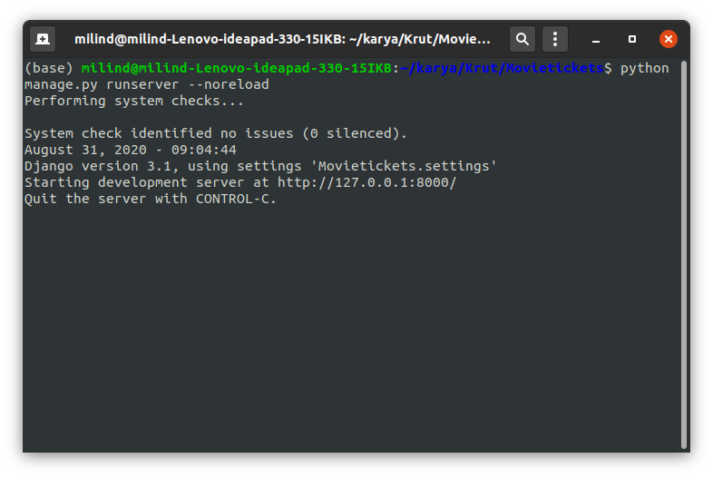
* Open Postman and click on Import button.
* Select `Movie tickets.postman_collection.json` from Movietickets cloned repository and click Import.
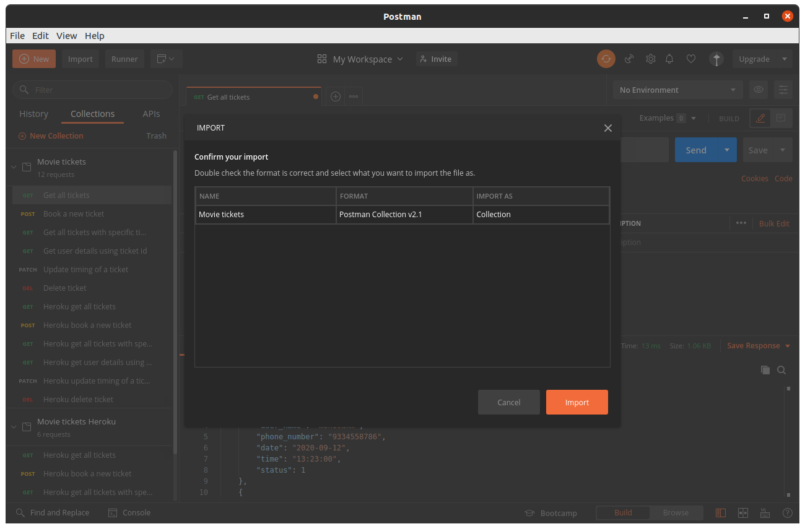
* Now you can run individual requests one by one or run all requests and tests using Runner.
#### 2.  Using https://movie-tickets-api.herokuapp.com/bookings_api/
An instance of the API is deployed on __Heroku__ that can be accessed using __Postman__. This removes the requirement for downloading dependencies and running the django server on the local machine. This instance of API is not accessible through web browsers and is comparatively slower than the localhost instance.
* Git clone the repository on local system and change directory to Movietickets.
* Open Postman and click on Import button.
* Select `Movie tickets Heroku.postman_collection.json` from Movietickets cloned repository and click Import.
* Now you can run individual requests one by one or run all requests and tests using Runner.

## API endpoints description
#### 1. GET booking/
This endpoint fetches all of the tickets available currently in the database.

##### Arguments
None

##### Localhost example
http://localhost:8000/bookings_api/booking/

##### Heroku example
https://movie-tickets-api.herokuapp.com/bookings_api/booking/

##### Example Response
> [{
        "ticket_id": 3,
        "user_name": "milind",
        "phone_number": "9334556789",
        "date": "2020-09-12",
        "time": "13:30:00",
        "status": 1
    },
    {
        "ticket_id": 4,
        "user_name": "milind",
        "phone_number": "9334556789",
        "date": "2020-08-30",
        "time": "13:30:00",
        "status": 1
    }]

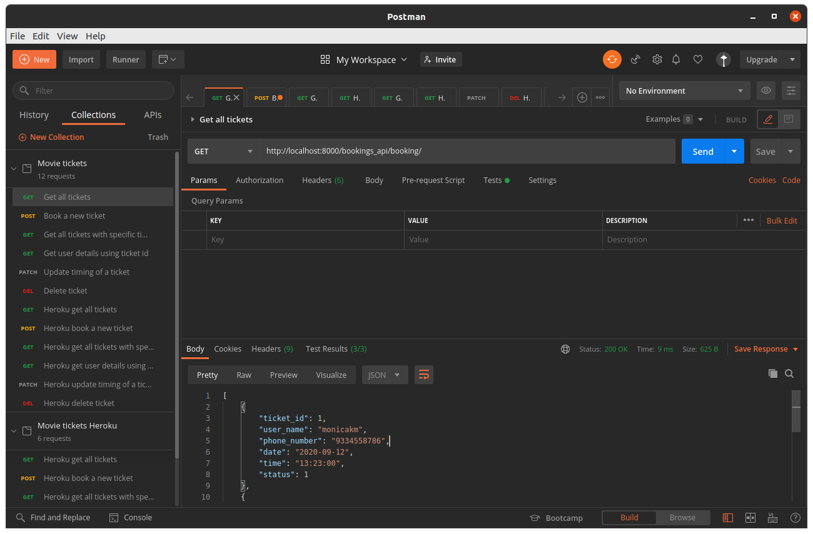

#### 2. POST booking/
This endpoint makes a new ticket entry in the database and returns the ticket id if successful. More than 20 tickets cannot be booked for a particular date and time. All times are pre-scheduled and can be one of these - (08:00, 10:45, 13:30, 16:15, 19:00, 21:45)

##### Arguments
user_name -  Alphanumeric user's name\
phone_number - Numeric user's phone number\
date - Date in YYYY-MM-DD format\
time - Time in HH:MM format

##### Localhost example
http://localhost:8000/bookings_api/booking/

##### Heroku example
https://movie-tickets-api.herokuapp.com/bookings_api/booking/

##### Example Response
> {
    "Status": "Success",
    "Description": "Ticket 8 sucessfully created"
}

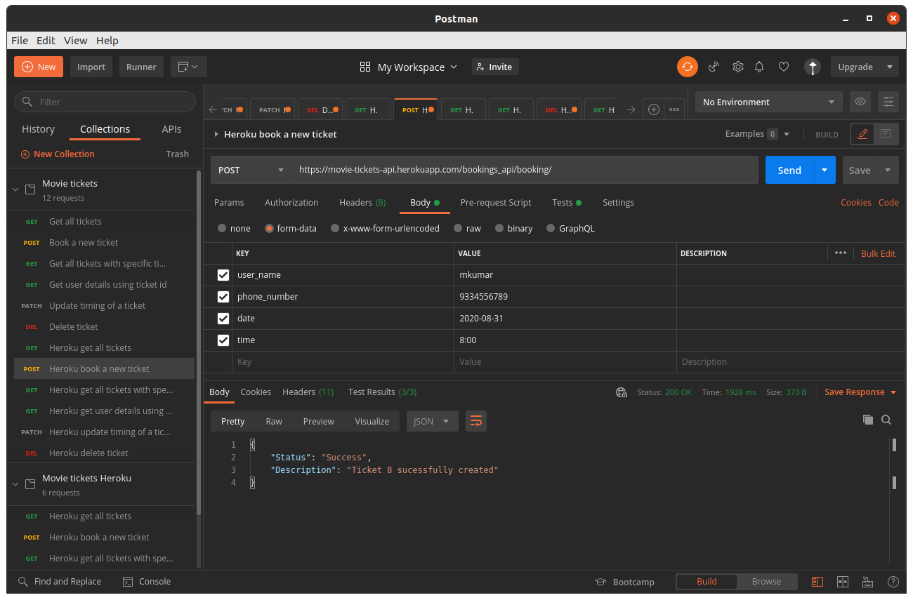

#### 3. GET booking/?date={date}&time={time}
This endpoint fetches all of the tickets which has same date and time as provided by the arguments.

##### Arguments
date - Date in YYYY-MM-DD format\
time - Time in HH:MM format

##### Localhost example
http://localhost:8000/bookings_api/booking/?date=2020-09-12&time=13:23
##### Heroku example
https://movie-tickets-api.herokuapp.com/bookings_api/booking/?date=2020-09-12&time=13:23

##### Example Response
> [
    {
        "ticket_id": 1
    }
]

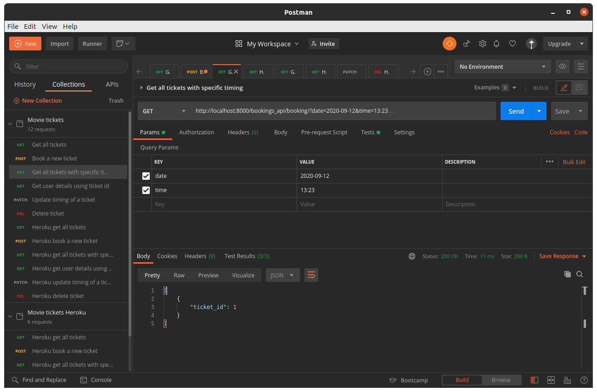

#### 4. GET booking/{id}/
This endpoint fetches the username and phone number associated with the given ticket id.

##### Arguments
Replace {id} with ticket id

##### Localhost example
http://localhost:8000/bookings_api/booking/1/

##### Heroku example
https://movie-tickets-api.herokuapp.com/bookings_api/booking/1/

##### Example Response
> {
    "user_name": "milind",
    "phone_number": "9334556789"
}

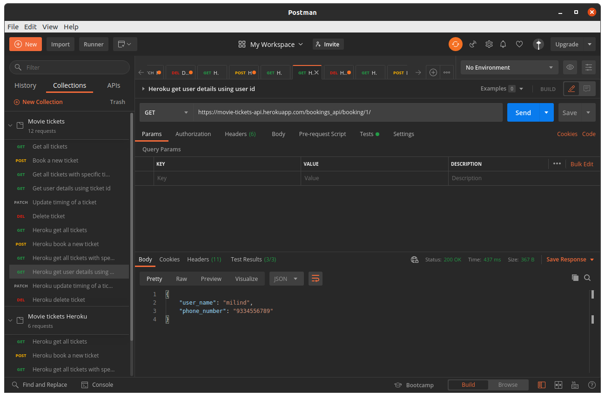

#### 5. PATCH booking/{id}/
This endpoint updates the date and time of a given ticket id.All times are pre-scheduled and can be one of these - (08:00, 10:45, 13:30, 16:15, 19:00, 21:45)

##### Arguments
Replace {id} with ticket id

##### Localhost example
http://localhost:8000/bookings_api/booking/2/

##### Heroku example
https://movie-tickets-api.herokuapp.com/bookings_api/booking/1/

##### Example Response
> {
    "status": "Success",
    "Description": "Ticket updated successfully"
}

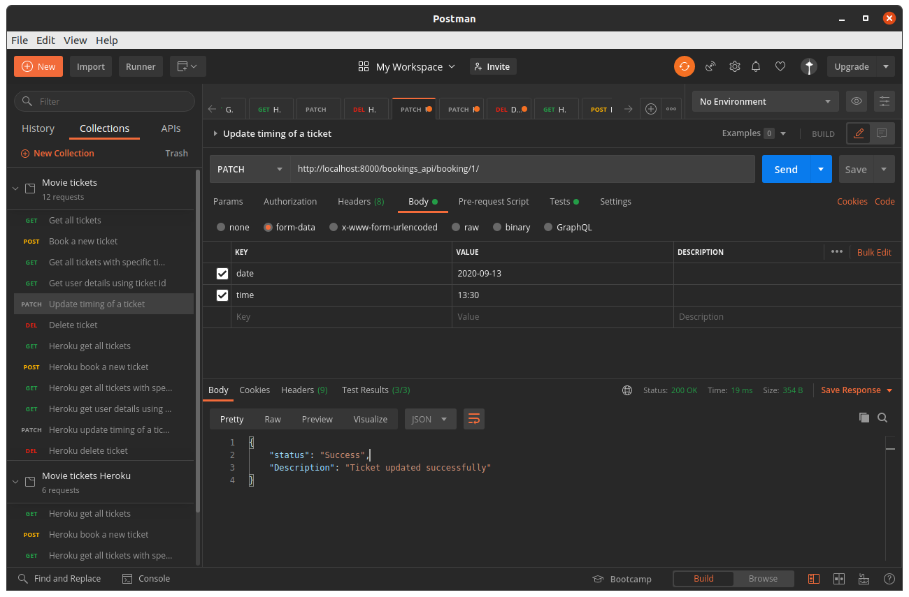

#### 6. DELETE booking/{id}/
This endpoint deletes the ticket with given id from the database.

##### Arguments
Replace {id} with ticket id

##### Localhost example
http://localhost:8000/bookings_api/booking/3/

##### Heroku example
https://movie-tickets-api.herokuapp.com/bookings_api/booking/3/

##### Example Response
> {
    "status": "Success",
    "Description": "Ticket deleted successfully"
}

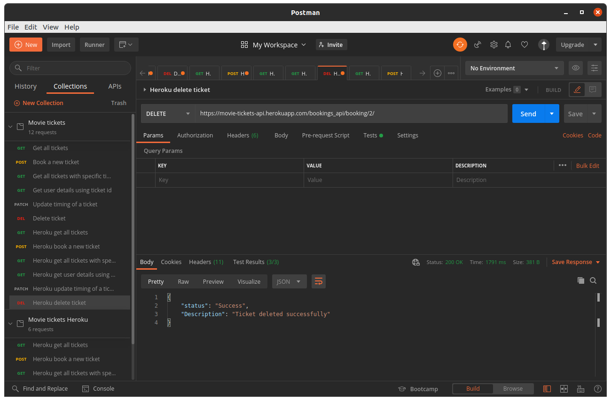

## Database description
We are using __Sqlite__ to store all our data. Our database has one table named __Booking__ with the following schema

ticket_id | user_name | phone_number | date | time | status |
---------|----------|--------- |--------- |--------- |--------- |

__Description of columns__

Column name | Description |
---------|----------|
 __ticket_id__ | Primary key, acts as unique identifier of every ticket |
 __user_name__ | User's name | 
 __phone_number__ | User's phone number |
 __date__ | Date in YYYY-MM-DD format|
 __time__ | Time in HH:MM format|
 __status__ | Validity of ticket, 1 is valid 0 is expired|

 ## Ticket expiry checking mechanism
 We have used Python's __APS__ process task scheduler to periodically check for tickets expiry. If a ticket is found with timings older than 8 hours then it's status flag is set to 0.
 The mechanism is built up of 3 python programs
 1. __time_scheduler.py__
 It schedules how often expiry_checker.py and expired_ticket_remover.py run.

 2. __expiry_checker.py__
 It runs every 30 seconds and checks if a ticket is expired by comparing ticket's timings with current timing. If a ticket is expired then it sets it's status flag as 0.
 3. __expired_ticket_remover.py__
 It runs every 110 seconds and deletes all tickets whose status flag is 0.

 Since, the APS process scheduler is asynchronous in nature, we do not need to restart the server to delete the tickets. All expired tickets are removed __on the fly__ without affecting the server.

## Tests
Tests are written in Postman to check the status codes, response times and if the response being sent is empty or not. All tests can be tested at once by running the collection in __Runner__.

__Some screenshots of tests being run in Postman__
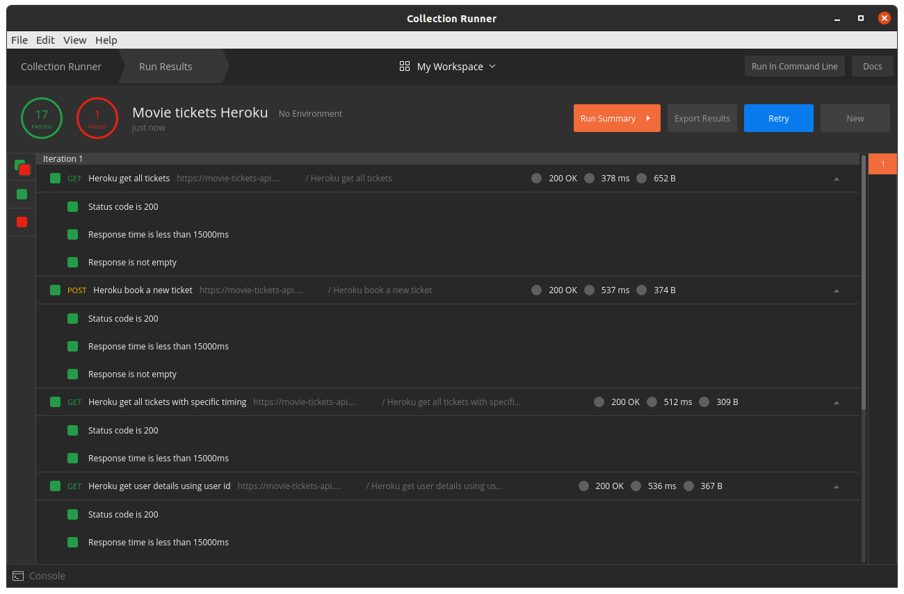
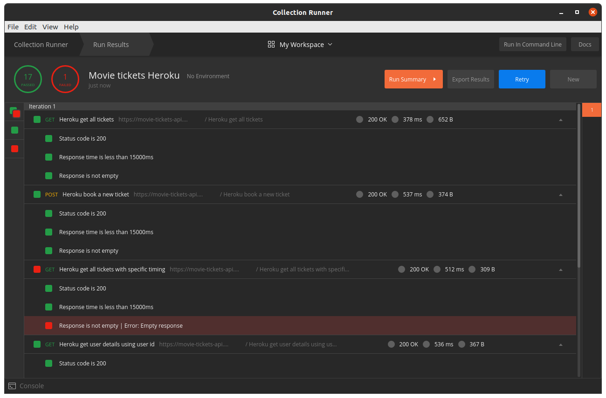
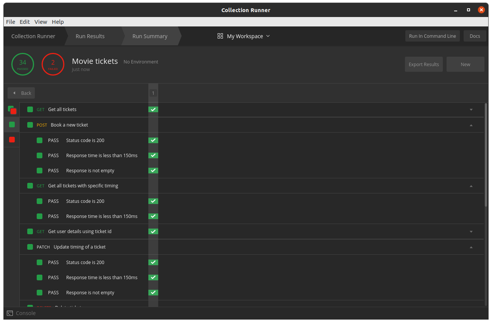
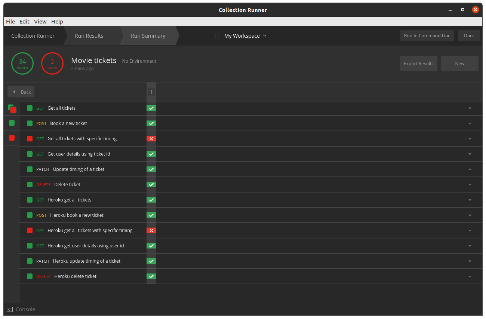

__We hope that you like the project :-)__
__Please suggest any changes you like by openeing up issues.__